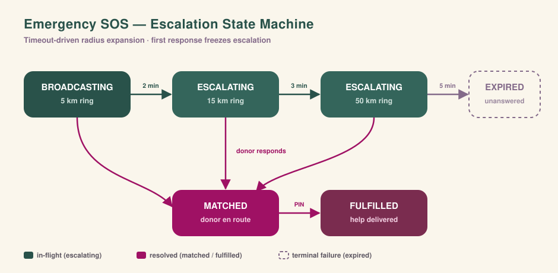

<div align="center">


# Sahayam

### Find a blood donor, closer than you think.

A real-time network that connects blood emergencies with **verified, compatible donors nearby** — raise an SOS and reach the right people in seconds.

<br/>

[](https://sahayam-beta.vercel.app)
&nbsp;
[](#-the-routing-engine)

<br/>


</div>

> [!NOTE]
> The API runs on a free tier and **sleeps when idle** — the first request after a quiet spell can take ~30–50s to wake. Give it a moment on the first load.

---

## 📸 Screenshots

<div align="center">

<!-- Drop your images in docs/screenshots/ and uncomment:


-->

_The **Blood Radar** map, an **SOS in flight**, and the **admin dashboard** make the strongest first impression — add 2–4 shots here._

</div>

---

## ✨ Why Sahayam

When a family needs blood, every minute counts. A WhatsApp forward is slow, untargeted, and exposes private numbers. Sahayam replaces it with a **medically-correct, location-aware matching engine** that alerts only the donors who can actually help — and keeps widening the search until enough confirm.

| | Feature | What it does |
|---|---|---|
| 🩸 | **Blood Radar** | Location-based SOS that pings only **compatible, eligible** donors nearby. No response? The engine widens the radius and pings a **fresh** ring — never re-pinging anyone. |
| 🧬 | **Medically-correct matching** | One matching path enforces blood-group compatibility (O− universal donor, AB+ universal recipient) and a **90-day donor cooldown** everywhere it's used. |
| ⚡ | **Atomic claim** | Two heroes accept the same slot at once → exactly **one wins**, the rest get a clean `409`. No double-booking a donor. |
| 📡 | **At-least-once delivery** | Alerts fan out over **push *and* email** — for a life-critical message, receiving both is the safe failure mode. |
| 💬 | **Private real-time chat** | Requester and donor coordinate over Socket.io — **no phone number** exposed in a public forward. |
| 🤖 | **Smart Assistant** | Google Gemini turns a natural-language description of the emergency into a structured SOS (blood group, location, urgency). |
| 📊 | **Admin Command Center** | Activity heatmaps, live engine metrics (fill rate, time-to-first-response), moderation, and system-wide broadcasts. |

---

## 🧠 The Routing Engine

> The heart of Sahayam. A **single, unified matching path** serves every caller — the radar map, the emergency blast, and the escalation cron — so matching is consistent and medically correct everywhere.

An SOS is **not** a fixed broadcast. It's a timeout-driven **state machine** that escalates until the need is met:

<div align="center">
  
</div>

**How it works under the hood**

- **Donor matching** — `services/donorMatching.js` runs a `$geoNear` aggregation that returns donors pre-sorted by distance (with a real `distance` field for the map). A candidate must be a compatible blood group, **eligible**, available, within radius, and not already pinged.
- **Compatibility source of truth** — `utils/bloodCompat.js` holds the recipient/donor matrix, unit-tested in `tests/bloodCompat.test.js`.
- **Escalation** — if nobody responds at a level, a cron tick widens the radius and pings a **fresh** ring of donors. Guarded by a distributed **`CronLock`** so it stays correct across horizontally-scaled instances.
- **Observability** — `GET /api/admin/engine-metrics` reports fill rate, median time-to-first-response, and escalation-depth distribution.

```bash
# See the radar & escalation end-to-end with 200 synthetic donors:
node scripts/seedDonors.js      # ~20% on cooldown, varied blood groups
node scripts/seedDonors.js --clear
```

---

## 🏗️ Architecture

```
┌──────────────────────┐        REST + WebSocket        ┌──────────────────────┐
│   React SPA (Vite)    │  ───────────────────────────▶ │   Express API         │
│   maps · chat · dash  │ ◀───────────────────────────  │   JWT · business logic │
└──────────────────────┘                                └───────────┬──────────┘
                                                                     │
                  ┌──────────────────────────────────────┬──────────┼───────────────┐
                  ▼                                        ▼          ▼               ▼
            ┌───────────┐                          ┌────────────┐ ┌────────┐  ┌──────────────┐
            │  MongoDB  │                          │  node-cron │ │ Gemini │  │ Cloudinary    │
            │ (geo + ttl)│                         │ escalation │ │  AI    │  │ media uploads │
            └───────────┘                          └────────────┘ └────────┘  └──────────────┘
```

- **Frontend (SPA)** — Vite + React, handling maps, real-time chat, and dashboards over REST + WebSocket.
- **Backend (API)** — a monolithic Express server: business logic, MongoDB, JWT auth, AI integrations.
- **Background jobs** — cron expires stale SOS requests and drives radius expansion (distributed `CronLock`).
- **Media** — avatars and photos offloaded to Cloudinary via Multer.

---

## 🚀 Quick Start

**Prerequisites:** Node.js 18+, a MongoDB URI, and (optional) Cloudinary / Firebase / Gemini keys.

```bash
git clone <repository-url> && cd Sahayam

# Backend
cd backend && npm install && npm run dev      # → http://localhost:5000

# Frontend (in a second terminal)
cd frontend && npm install && npm run dev      # → http://localhost:5173
```

<details>
<summary><b>Environment variables</b></summary>

**`backend/.env`**
```env
PORT=5000
MONGO_URI=your_mongodb_connection_string
JWT_SECRET=your_super_secret_jwt_key
FRONTEND_URL=http://localhost:5173
CLOUDINARY_CLOUD_NAME=your_cloudinary_name
CLOUDINARY_API_KEY=your_cloudinary_api_key
CLOUDINARY_API_SECRET=your_cloudinary_api_secret
GEMINI_API_KEY=your_google_gemini_api_key
VAPID_PUBLIC_KEY=your_vapid_public
VAPID_PRIVATE_KEY=your_vapid_private
VAPID_EMAIL=mailto:admin@example.com
```

**`frontend/.env`** (see `frontend/.env.example`)
```env
# Backend API base URL — MUST include the /api suffix
VITE_BACKEND_URL=http://localhost:5000/api
VITE_GOOGLE_CLIENT_ID=your_google_client_id
VITE_VAPID_PUBLIC_KEY=your_vapid_public_key
VITE_MAPBOX_TOKEN=your_mapbox_token   # optional — labels your city on the radar
```
</details>

---

## 📡 API Reference

<details>
<summary><b>Endpoints</b></summary>

**Auth** &nbsp;`/api/auth`
| Method | Route | Description |
|---|---|---|
| `POST` | `/register` | Register a new user |
| `POST` | `/login` | Authenticate & get a JWT |
| `POST` | `/google` | Google OAuth login |
| `POST` | `/emergency-blast` | Trigger a location-based SOS |

**Donations & SOS** &nbsp;`/api/donations`
| Method | Route | Description |
|---|---|---|
| `GET` | `/feed` | Personalized, proximity-based feed |
| `POST` | `/` | Create a request (supports image upload) |
| `PATCH` | `/:id/sos-accept` | Accept an emergency SOS (atomic claim) |
| `POST` | `/triage` | AI-powered triage analysis |

**Chat** &nbsp;`/api/chat`
| Method | Route | Description |
|---|---|---|
| `GET` | `/inbox` | Active conversations |
| `GET` | `/:donationId` | Chat history for a request |
| `POST` | `/` | Send a message |

**Admin** &nbsp;`/api/admin`
| Method | Route | Description |
|---|---|---|
| `GET` | `/stats` | Platform metrics |
| `GET` | `/heatmap` | Geographical incident data |
| `GET` | `/engine-metrics` | Fill rate, time-to-first-response |
| `POST` | `/broadcast` | Platform-wide alert |

</details>

---

## 🔄 User Flow

1. **Sign up** as a donor with your blood group and location.
2. **Raise an SOS** — drop a pin, enter blood group, hospital, and how many donors you need.
3. **Smart routing** pings compatible, eligible donors nearby via push + email; no response → it widens.
4. **Accept** (atomic claim — one wins per slot) opens a secure real-time chat.
5. **Fulfill** — confirm in chat, meet at the hospital, mark the request **Fulfilled**.

---

## 🔐 Security

- **Hardened headers** via Helmet.js.
- **Tiered rate limiting** — separate limiters for general API, writes, auth, and OTP endpoints.
- **Input sanitization** — `express-mongo-sanitize` + `xss-clean` against NoSQL injection and XSS.
- **Auth** — JWT with bcrypt password hashing; Socket.io connections are token-authenticated.

---

## 🗺️ Roadmap

- [ ] **Redis** — offload Socket.io state + distributed rate-limiting for horizontal scale.
- [ ] **Automated verification** — third-party KYC for medical professionals and NGOs.
- [ ] **SMS fallback** (Twilio) for users without reliable push/internet.
- [ ] **AI moderation** — spam/abuse detection before posts hit the database.

> **Known limits today:** identity verification is admin-moderated (no automated KYC yet); geolocation depends on device HTML5 accuracy; cron runs on a single instance (a distributed worker like BullMQ + Redis is the next step).

---

## 🤝 Contributing

1. Fork & clone, then branch: `git checkout -b feature/your-feature`
2. Commit using conventional commits, push, and open a PR describing the scope.
3. Ensure ESLint passes and you follow the existing component structure.

---

<div align="center">

Built with 🩸 to make blood reach people in time.

**License:** ISC

</div>
